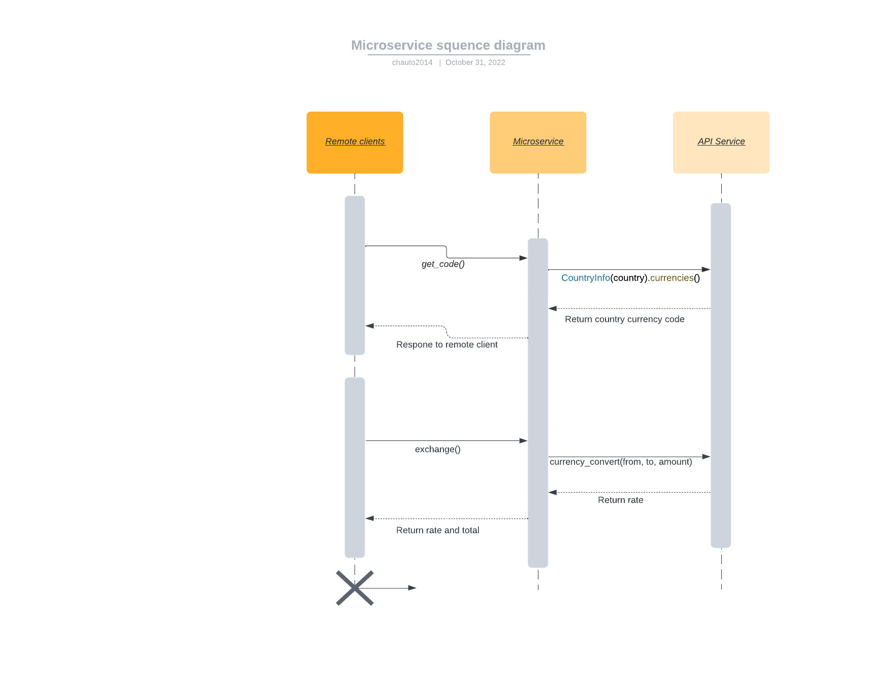

I. Currency exchange request 
    1. Instructions how to REQUEST data from currency_exchange microservice that I provided for remote clients  
        The currency_exchange_server always turns on on my computer (acts as server that the currency_exchange microservice runs on)
        As a remote client who wants to request data from the microservice, you need to:  
            - import class currency_exchange_client into  your  python project  
            - import json since my microservice will return you a json object as a string that is transmitted by using rabbitMQ  
            - Then create an object curr with the construction method of class CurrConverter with three parameters: base_currency, dest_currency, and amount
            Using method exchange() without parameter to call for service. 
            For example: code showed how to call the service is given below 
            ####################################################
            from currency_exchange_client import CurrConverter
            import json

            curr = CurrConverter('USD', 'JPY', 9) #first parameter is your base currency, second parameters is your destination currency, the last parameter is the amount that you want to exchange
            print(" [x] Requesting currency exchange from %s to %s with an amount %f" %(curr.getRequestStr()['from_currency'], curr.getRequestStr()['to_currency'], curr.getRequestStr()['amount']))
            response = json.loads(curr.exchange())
            ####################################################
    2. Instructions how to RECEIVE data from the microservice after making a call to
        You will receive a string as a json string
        You will want to convert it into json object using loads function
        You can extract total and rate data by getting the obj['total'] and obj['rate']

            For example: code showed how to receive data from the microservice
            ####################################################
            response = json.loads(curr.exchange())
            if response['rate'] and response['total']:
                print("Rates is %.2f and total is %.2f" %(response['rate'], response['total'])) #you will get a reponse json object which is presented like {'total':[Total Amount], 'rate': [Rate]}
            else:#if you provide the wrong currency or the currency that my microservice has not yet provided, you will receive this message
                print("Currency Rates Source Not Ready yet!!! sorry for inconvenience")
            ####################################################

    3. Put them together
            from currency_exchange_client import CurrConverter
            import json

            curr = CurrConverter('USD', 'JPY', 9) #first parameter is your base currency, second parameters is your destination currency, the last parameter is the amount that you want to exchange
            print(" [x] Requesting currency exchange from %s to %s with an amount %f" %(curr.getRequestStr()['from_currency'], curr.getRequestStr()['to_currency'], curr.getRequestStr()['amount']))
            response = json.loads(curr.exchange())
            if response['rate'] and response['total']:
                print("Rates is %.2f and total is %.2f" %(response['rate'], response['total'])) #you will get a reponse json object which is presented like {'total':[Total Amount], 'rate': [Rate]}
            else:#if you provide the wrong currency or the currency that my microservice has not yet provided, you will receive this message
                print("Currency Rates Source Not Ready yet!!! sorry for inconvenience")
II. Currency code request  
    1. Request data  
        - create an CurrCode object 
        - call function get_code() 
        - example: 
        curr_code = CurrCode('Japan') 
        response = curr_code.get_code() 
    2. Receive data 
        data will return to response variable 
    3. put them together 
        from country_currency_code import CurrCode 

        curr_code = CurrCode('Japan')
        response = curr_code.get_code()
        if response == None:
            print("Country is not available!!! Please check again")
        else:
            print(response.decode('UTF-8'))

            
